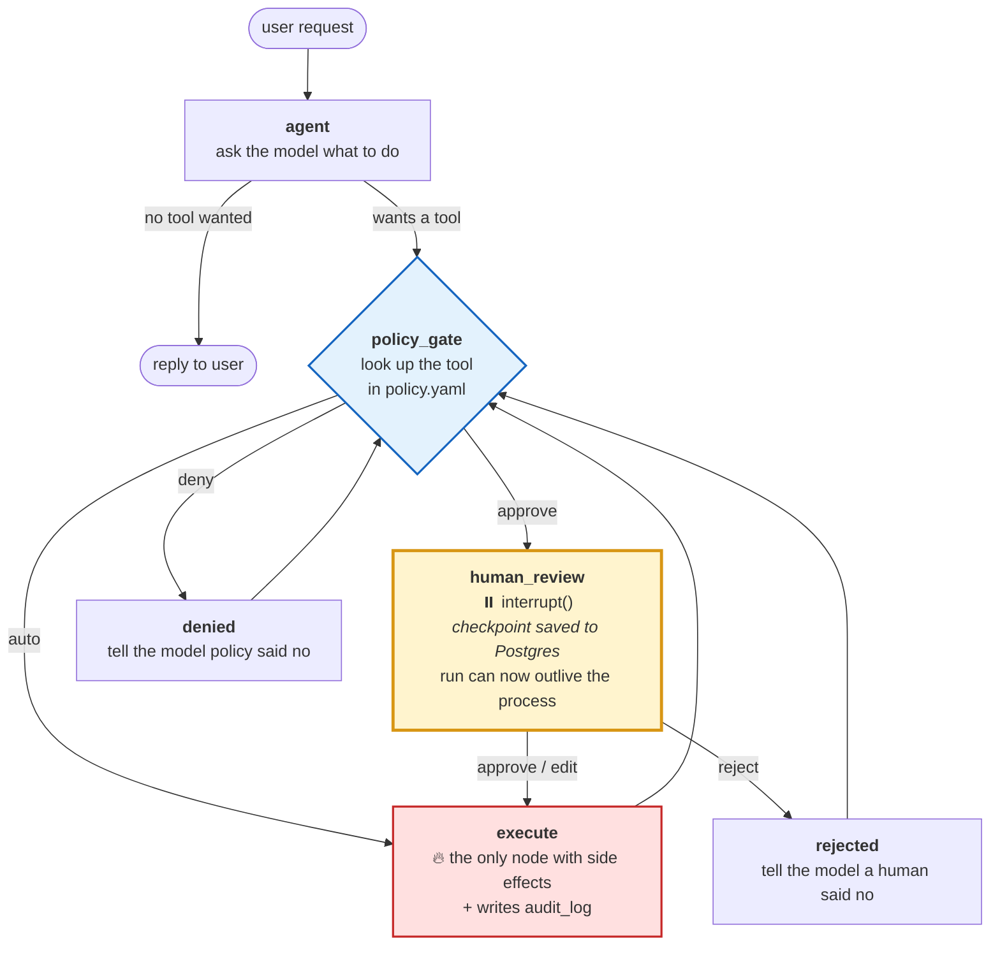

# 🔐 Interlock

**An AI agent that can take real actions — call an API, write to a database, send an email — but stops and asks a human before anything risky.**

Built with LangGraph's `interrupt()` / `Command(resume=...)`, checkpointed to Postgres so a pending approval survives a process restart.

```
User: "File a ticket for the disk alert and email the team about it."

  🔧 fetch_url        → runs immediately        (read-only, nothing to fear)
  ⏸️  create_ticket    → PAUSED, waiting for you (it's a write)
  ⏸️  send_email       → PAUSED, waiting for you (it leaves the building)
```

---

## 1. The problem, in plain terms

An LLM agent that can only *talk* is safe and not very useful. An agent that can *act* is useful and not very safe — it will occasionally email the wrong person, or file a ticket marked `urgent` when it means `normal`.

The usual fix is to bolt an `if tool == "send_email": input("ok? ")` onto the loop. That breaks the moment you have more than one user, more than one tool, or a reviewer who isn't sitting at the terminal.

**Interlock treats "wait for a human" as real infrastructure**, not a prompt. The agent's run is paused and *persisted to a database*. It can sit there for an hour. The server can restart. A different person can open a web page, look at exactly what the agent proposed, **change the arguments if they're wrong**, and let it continue.

### The one property that matters

> The side effect has **not happened yet** when the human is asked.

Everything in this project exists to make that true and keep it true. It's the first test in the suite:

```python
result = await graph.ainvoke({"messages": [HumanMessage("Email ops about the disk alert.")]}, config)

assert "__interrupt__" in result          # the graph paused
assert not email_was_delivered            # and nothing went out
```

---

## 2. See it work in 10 seconds

No Docker, no database, no API key needed:

```bash
python scripts/demo.py
```

It walks one run through every outcome — a pause, a human **editing** the arguments, a second pause, a **rejection** — and prints the audit trail at the end. Abridged output:

```
2. The agent proposes a database write — the gate stops it
──────────────────────────────────────────────────────────
  ⏸  THE GRAPH IS PAUSED. Nothing has happened yet.

     tool        create_ticket
     reversible  yes
     proposed arguments:
       { "title": "disk thing", "priority": "urgent" }

     tickets in the database right now: 0  ← still nothing written

3. The human EDITS the arguments rather than rejecting
──────────────────────────────────────────────────────────
     ✅ written: #1 [high] Disk usage at 98% on node 3
        (the agent's version was never written)
```

---

## 3. The tech stack, and why each piece is there

| Layer | Choice | Why this one |
|---|---|---|
| **Agent framework** | **LangGraph** (`interrupt()` + `Command(resume=...)`) | The only mainstream framework where "pause mid-run and resume later" is a first-class primitive rather than something you fake with a state machine. |
| **Language** | **Python 3.12+** | Async throughout — the agent is I/O-bound (model calls, HTTP, DB, SMTP), so nothing blocks. |
| **Memory / durability** | **`langgraph-checkpoint-postgres`** (`AsyncPostgresSaver`) on **Postgres 16** | This is the load-bearing choice. A paused approval that dies with the process is not an approval workflow. Postgres makes the pause outlive the request *and* the server. `MemorySaver` is used **only in tests**. |
| **API** | **FastAPI** | Three endpoints carry the whole workflow. Async-native, and the request/response models are Pydantic so the OpenAPI docs are free. |
| **Database (app data)** | **SQLAlchemy 2.0 async** + asyncpg | Kept deliberately separate from the checkpointer, which speaks psycopg and owns its own tables. Agent memory and business data never share a session. |
| **Fake email** | **Mailpit** in Docker | An SMTP server that accepts everything and delivers nothing. `send_email` genuinely executes — a bug in it is a *real* bug — but the blast radius is zero. Read what the agent "sent" at `localhost:8025`. |
| **Policy** | **YAML + Pydantic** | Risk tiers live in a config file, validated on load, consulted at runtime. Change agent behaviour without touching code. |
| **Review UI** | **Streamlit** | Renders the pending call with its arguments as **editable JSON**. A thin client over the API — it holds no state of its own. |
| **Tracing** | **Langfuse** (self-hosted, optional) | Shows *what the model was thinking*. Complements — does not replace — the audit log. |
| **Audit** | Your own `audit_log` table | Shows *who authorised what*. Arguably half the value of the project. See §7. |
| **Tests** | **pytest + pytest-asyncio** | 43 tests. The important ones assert the graph halts **before** the side effect fires. |
| **Model** | **Claude Opus 5** (`claude-opus-5`) via `langchain-anthropic` | Swappable in one line — `app/llm.py`. |

---

## 4. How it flows



Step by step:

1. **`agent`** — the model sees the conversation and the three tools, and either answers or asks for a tool.
2. **`policy_gate`** — looks the tool up in `policy.yaml` and classifies it `auto` / `approve` / `deny`. It only *decides*; it never runs anything.
3. The fork:
   - **`auto`** → straight to `execute`. Nobody is interrupted (but it's still audited).
   - **`approve`** → `human_review`, which calls `interrupt()`. **The graph stops here.** LangGraph writes a checkpoint to Postgres containing the whole run: messages, the pending call, everything.
   - **`deny`** → `denied`. The tool never runs and no human is bothered.
4. **The pause.** The HTTP request that started the run returns with an approval request. The run is now just a row in Postgres, keyed by `thread_id`.
5. **Resume.** Someone `POST`s a decision. LangGraph loads the checkpoint, `interrupt()` returns their answer, and the graph continues from exactly where it stopped.
6. **`execute`** — runs the tool and writes an `audit_log` row. Loops back to the gate to pick up the next tool call from the same turn, then back to the model.

### The gate, in three tiers

| Tool | Tier | Why |
|---|---|---|
| `fetch_url` | 🟢 **auto** | An HTTP GET. No side effect, cheap to retry. |
| `create_ticket` | 🟡 **approve** | Writes a database row. Reversible, but it's a write. |
| `send_email` | 🟡 **approve** *(floored)* | Leaves the system and reaches a person. **Cannot be un-sent.** |

---

## 5. The two things that will bite you

These are the parts that make this more than a tutorial. Both are handled in the code and pinned by tests.

### ⚠️ Trap 1: on resume, the node re-runs *from the top*

The most common way to get this wrong. When you resume, LangGraph **re-executes the whole node from its first line** — not from the `interrupt()` call. `interrupt()` then returns the resume value instead of pausing.

So any side effect placed *before* `interrupt()` **fires twice**: once when the graph pauses, once when it resumes.

```python
# 💣 WRONG — the email goes out, THEN you're asked to approve it,
#            and it goes out again when you say yes.
async def review_and_send(state):
    await send_email(...)                # runs on pause AND on resume
    decision = interrupt({...})
    ...
```

**The fix used here:** approval lives in its own node that does *nothing but* wait and report the answer. All side effects live in a separate `execute` node, which contains no `interrupt()` and therefore never replays mid-flight. The rule is written directly above the call in [app/graph/nodes.py](app/graph/nodes.py):

```python
# THE ONE RULE OF THIS NODE.
#
# When the graph resumes, LangGraph re-runs this node from its first line —
# not from the interrupt() call. Everything above is a pure read of state,
# so executing it a second time changes nothing.
#
# Never put a side effect above this line.
answer = interrupt(payload)
```

Pinned by a test that counts deliveries across the pause and asserts exactly `1`.

### ⚠️ Trap 2: approve/reject is not enough

Most examples stop at a binary yes/no. But in practice a reviewer usually agrees with **what** the agent wants to do and disagrees with a **detail** — the wrong recipient, an over-eager priority, a subject line that reads badly. Forcing them to reject and re-prompt is why approval queues get abandoned.

So the resume payload is **three-way**:

```jsonc
{ "action": "approve" }                                    // run it as proposed
{ "action": "reject",  "reason": "Too broad an audience." } // don't run it
{ "action": "edit",    "args": { "to": "oncall@..." } }     // run it with MY arguments
```

Both versions are kept in the audit log, so you can always see what the agent wanted versus what a human actually let through. **This is the feature real users care about.**

---

## 6. Defence in depth: policy can only ever tighten

`policy.yaml` maps a tool name to a mode:

```yaml
default: deny          # a tool with no rule is blocked

tools:
  fetch_url:
    mode: auto
  send_email:
    mode: approve
    reason: "Leaves the system and reaches a human. Never auto-approved."
```

But config alone isn't enough — a typo shouldn't be able to disarm the interlock. So **each tool also declares a floor in code**, next to the tool itself, because it's a property of what the tool *does*:

```python
ToolSpec(tool=send_email, floor=Mode.APPROVE, reversible=False)
```

If `policy.yaml` says `auto` for `send_email`, **the floor wins**, the call still pauses, and the escalation is recorded in the audit log. Configuration can make the system stricter. It can never make it looser.

```python
def test_policy_cannot_downgrade_email_to_auto():
    decision = engine_with(send_email=Mode.AUTO).evaluate("send_email", floor=Mode.APPROVE)
    assert decision.mode is Mode.APPROVE
    assert decision.floor_applied
```

---

## 7. The audit log

One row per gated tool call — whether it ran, was rejected, or was blocked. There is no path through the graph that performs an action without leaving a record.

| Column | What it answers |
|---|---|
| `tool_name`, `thread_id`, `tool_call_id` | Which action, on which run |
| `policy_mode`, `policy_source`, `policy_reason` | Why it was gated at all |
| `decision` | `auto_approved` / `approved` / `edited` / `rejected` / `denied` |
| `decided_by`, `decided_at`, `decision_reason` | **Who** said yes, when, and why |
| `proposed_args` vs `final_args` | What the agent wanted vs what actually ran |
| `args_modified` | Did a human change it |
| `status`, `result_summary`, `error`, `duration_ms` | What happened |

That `proposed_args` / `final_args` pair is the interesting bit. It's the record of *human judgment applied to an AI's proposal* — and it doubles as training data for what your agent gets wrong.

It also does real work: before executing, the node asks the audit table whether this exact `tool_call_id` already completed. If the process died between sending an email and writing its checkpoint, LangGraph would replay that node on restart — the audit table is the durable record that stops the second send.

---

## 8. Project layout

```
interlock-agent/
├── policy.yaml               ← the risk tiers. Edit this, not the code.
├── docker-compose.yml        ← Postgres 16 + Mailpit (+ optional Langfuse)
│
├── app/
│   ├── config.py             Settings from .env (Pydantic)
│   ├── policy.py             Policy engine: YAML → decision. Floors, hot reload.
│   ├── db.py                 SQLAlchemy models: tickets, audit_log
│   ├── audit.py              Writes/reads the audit trail
│   ├── llm.py                Model construction (+ the scripted double)
│   ├── observability.py      Optional Langfuse tracing
│   │
│   ├── tools/
│   │   ├── http_get.py       🟢 read-only    → auto
│   │   ├── db_write.py       🟡 DB write     → approve
│   │   ├── email.py          🟡 real SMTP    → approve (floored)
│   │   └── registry.py       Tool → risk floor mapping
│   │
│   ├── graph/
│   │   ├── state.py          Graph state + the 3-way resume payload
│   │   ├── nodes.py          ★ THE CORE — read human_review first
│   │   └── build.py          Graph assembly + checkpointer wiring
│   │
│   └── api/
│       ├── main.py           FastAPI: 3 run endpoints + audit + policy
│       └── schemas.py        Request/response models
│
├── ui/streamlit_app.py       The approval queue (editable JSON args)
├── scripts/demo.py           Zero-setup walkthrough
├── scripts/init_db.py        Create both sets of tables
└── tests/                    43 tests
```

**If you read three files:** [app/graph/nodes.py](app/graph/nodes.py) (the gate), [app/policy.py](app/policy.py) (the rules), [tests/test_interrupt_halts.py](tests/test_interrupt_halts.py) (the proof).

---

## 9. Running it for real

**Prerequisites:** Python 3.12+, Docker, an Anthropic API key.

```bash
# 1. Infrastructure — Postgres 16 + Mailpit
docker compose up -d

# 2. Python
python -m venv myenv && myenv\Scripts\activate    # Windows
# source myenv/bin/activate                       # macOS / Linux
pip install -e ".[dev]"

# 3. Configure
cp .env.example .env        # then add your ANTHROPIC_API_KEY

# 4. Create the tables (the API does this on startup too)
python scripts/init_db.py

# 5. Run the API
uvicorn app.api.main:app --reload

# 6. Run the review UI (separate terminal)
streamlit run ui/streamlit_app.py
```

| What | Where |
|---|---|
| Review UI | http://localhost:8501 |
| API docs (Swagger) | http://localhost:8000/docs |
| **Mailpit — read what the agent sent** | http://localhost:8025 |
| Langfuse (optional) | http://localhost:3000 |

Then ask it something that needs approval:

> *"Email oncall@example.com about the disk alert on node 3."*

It'll come back for review. Edit the subject line before you approve, then check Mailpit — you'll see **your** version arrive, not the agent's.

---

## 10. The API

Three endpoints carry the workflow. `thread_id` isn't an application concept layered on top of LangGraph — it **is** the checkpoint thread.

#### `POST /runs` — start

```bash
curl -X POST localhost:8000/runs -H 'Content-Type: application/json' \
  -d '{"message": "Email oncall@example.com about the disk alert."}'
```
```jsonc
{
  "thread_id": "run-a1b2c3d4e5f6",
  "status": "awaiting_approval",       // ← the graph is parked in Postgres
  "approval": {
    "tool": "send_email",
    "args": { "to": "oncall@example.com", "subject": "Disk alert", "body": "..." },
    "effect": "Delivers a message to an external recipient.",
    "reversible": false,
    "policy_reason": "Leaves the system and reaches a human. Never auto-approved.",
    "agent_rationale": "I'll notify oncall about the disk alert.",
    "actions": ["approve", "reject", "edit"]
  }
}
```

#### `GET /runs/{thread_id}` — inspect

Returns the same shape. Safe to call from a different process, an hour later, after a restart.

#### `POST /runs/{thread_id}/resume` — decide

```bash
curl -X POST localhost:8000/runs/run-a1b2c3d4e5f6/resume \
  -H 'Content-Type: application/json' \
  -d '{
        "action": "edit",
        "args": {"to": "oncall@example.com", "subject": "Disk usage on node 3", "body": "..."},
        "actor": "alice@example.com",
        "reason": "Toned down the subject line."
      }'
```

Returns `409` if the run isn't waiting for anything, `404` if the thread doesn't exist, `422` if you send `edit` without `args`.

**Plus:** `GET /runs/{thread_id}/audit` · `GET /audit` · `GET /policy` (what the gate will do with each tool right now, floors included) · `GET /health`

---

## 11. Tests

```bash
pytest
# 43 passed
```

The suite runs with **no Postgres, no SMTP server and no API key** — `MemorySaver` for checkpoints, SQLite for app tables, a scripted stand-in model, and a recorder in place of SMTP delivery. That last one is what lets a test tell the difference between *"the agent wanted to send"* and *"an email actually went out"*.

What's actually pinned:

- ✅ The graph **halts before** the email is sent, and before the DB row is written
- ✅ The side effect fires **exactly once** across the pause *(the replay trap)*
- ✅ `approve` runs the original args · `reject` blocks and tells the model why · **`edit` runs the human's args, not the agent's**
- ✅ A policy file saying `auto` for `send_email` **still pauses** *(the floor)*
- ✅ Denied tools never run *and* never interrupt a human
- ✅ Mixed turns: the read-only call proceeds while the risky one waits
- ✅ Every tool call in a turn gets a result, including rejected ones
- ✅ A malformed resume payload is treated as a rejection *(fail closed)*
- ✅ A broken policy file keeps serving the last good policy *(the gate never goes offline)*

---

## 12. For your resume

**Interlock — human-in-the-loop approval gateway for AI agents** · *Python, LangGraph, FastAPI, Postgres, SQLAlchemy 2.0*

- Built a **human-in-the-loop agent platform** using LangGraph's `interrupt()` / `Command(resume=...)`, with runs checkpointed to **Postgres** so a pending approval survives process restarts and can be resumed by a different worker.
- Designed a **three-tier policy engine** (YAML + Pydantic, default-deny) that classifies every tool call as auto / approve / deny **before dispatch**, with code-declared risk floors that prevent a misconfigured policy file from auto-approving irreversible actions.
- Implemented a **three-way approval protocol** — approve, reject, and **edit-then-approve** — letting reviewers correct an agent's tool arguments in flight; both proposed and final arguments are persisted for audit.
- Solved LangGraph's **node-replay hazard** (nodes re-execute from the top on resume) by isolating the approval wait in a side-effect-free node, and added an **idempotency guard** keyed on the audit table so a crash mid-execution cannot double-send.
- Shipped an **append-only audit trail** capturing approver identity, timestamps, policy rationale, and argument diffs, exposed via **FastAPI** with a Streamlit review console.
- Achieved **43 passing async tests** (pytest-asyncio) including the critical invariant that the graph halts *before* any irreversible side effect executes.

*Trim to 3–4 bullets for a one-page resume — keep the first, third, and fourth.*

---

## 13. What I'd add next

- **Auth.** `actor` is currently self-reported. Real deployment needs OIDC, and the audit log should record a verified identity.
- **Timeouts.** A run parked forever is a leak. Expire pending approvals after N hours and auto-reject.
- **Notifications.** Push pending approvals to Slack instead of waiting for someone to open the UI.
- **Argument validation on edit.** A reviewer's edited JSON is currently checked by the tool itself; validating against the tool's schema at resume time would give a better error.
- **A React console.** Streamlit is fast to build and fine for a demo; a small Next.js page would present better.

---

## License

MIT
